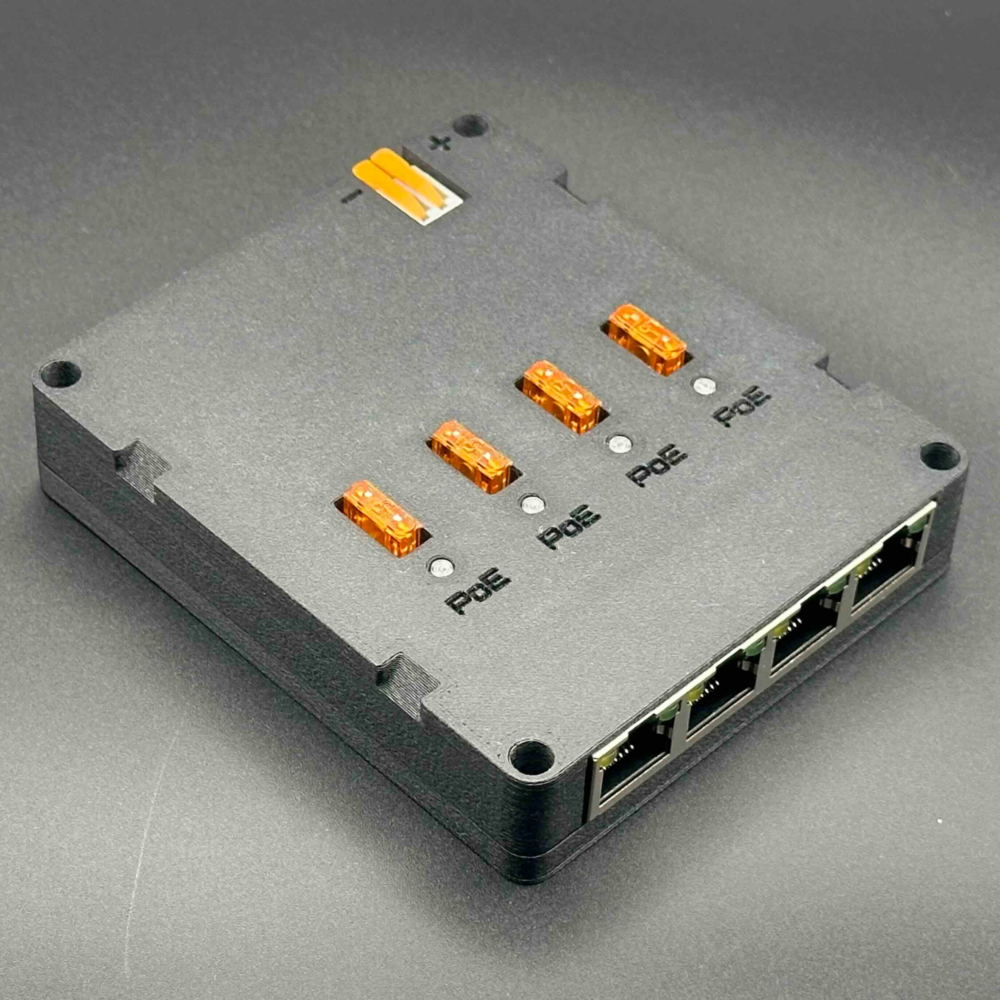

# LumaSwitch

{width="700"}

Five port passive PoE ethernet switch built specifically for the needs of FRC robots.

# Hardware Specs
* Same reliable buck-boost power stage of Luma P1
    * 3.3V - 22.5V Input range
    * Reverse polarity protection
    * WAGO 2601 power input
* Five port 10/100 unmanaged switch
* 4X ports with optional unregulated PoE output
    * Each port individually protected with a fuse
    * LED indicator when PoE is active
    * Remove fuse to disable PoE
* Versatile mounting
    * \#10 through holes on 0.5" pitch
    * Zip-tie notches
* Lightweight, less than 0.25lb with fuses installed

## Quick Links
* [Store Page](https://luma.vision/products/lumaswitch)
* [STEP file](files/LumaSwitch%20Assembly%20Public.step)
* [Mounting Diagram](files/LumaSwitch%20Assembly%20Public%20Drawing.pdf)
* [Enclosure 3D printing files]()